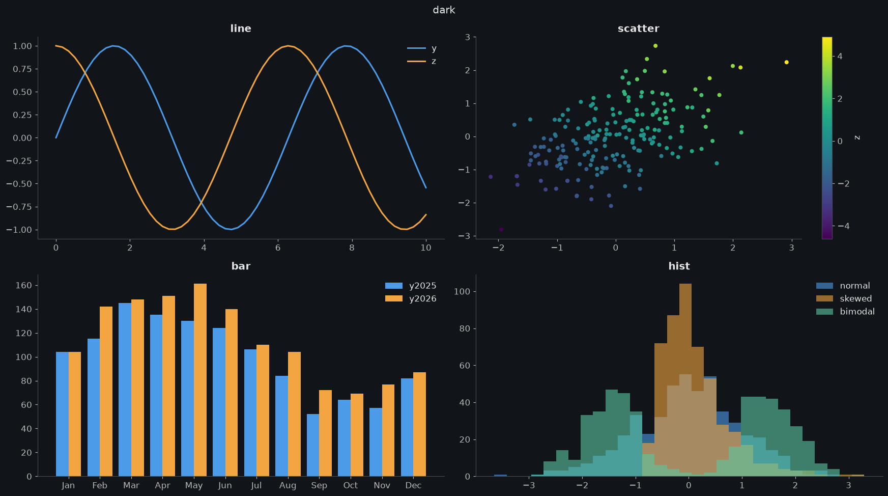

# kx-plot

One-line matplotlib plots and themes for notebooks and scripts.

`kx` is a small, plain-Python package with `.mplstyle` themes, palettes and colourmaps. It needs nothing beyond
matplotlib, numpy and pandas and works offline, so it also runs in Kaggle competition notebooks.



## Install

```bash
pip install kx-plot
```

```python
import kx; kx.use('dark')
```

### Kaggle

With internet off (competition notebooks), attach the dataset instead (**Add Input → Datasets → `vhrabar/kx-plot`**), then:

```python
import sys; sys.path.append('/kaggle/input/datasets/vhrabar/kx-plot')
import kx; kx.use('dark')
```

## Usage

```python
kx.use('light', palette='okabe', cmap='cividis')   # notebook default: theme, palette, colormap
kx.plot(x, y, z, 'scatter-grid-leg')               # spec: kind-theme-flag-...
kx.plot(x, y, 'bar-paper')                         # a theme in the spec applies to this plot only
```

| Token | Values                                                             |
|-------|--------------------------------------------------------------------|
| kind  | `line` `step` `area` `band` `scatter` `bar` `hist`                 |
| theme | `dark` `light` `paper` `science` `talk` `poster` `thesis`          |
| flags | `grid` `leg` `logx` `logy` `tight`, plus `stack` `norm` for `area` |

Unknown tokens raise an error instead of being guessed. Everything is inspectable:
`kx.grammar()`, `kx.grammar('area')`, `kx.show('dark')`, `kx.source('scatter')`.

rcParams can be overridden in `kx.use` with `__` for dots: `kx.use('dark', figure__figsize=(8, 4))`.

## Palettes

Palettes for `kx.use(theme, palette=...)`, they swap only the colours; a theme's
other cycled properties (such as `paper`'s linestyles) stay.

| Name                                     | Source             |
|------------------------------------------|--------------------|
| `okabe`                                  | Okabe & Ito (2008) |
| `tolbright` `tolvibrant` `tolhc` `tolmc` | Paul Tol           |
| `petroff6` `petroff8` `petroff10`        | Petroff (2021)     |
| `tab10` `tableaucb`                      | Tableau            |
| `set2` `dark2`                           | ColorBrewer        |
| `ibm`                                    | IBM Design Colors  |

`kx.palette('okabe')` returns the hex codes. A list of colours works too: `palette=['#264653', '#e9c46a']`.

## Colourmaps
<!-- TODO -->


## License

Released under the MIT License. See [`LICENSE`](LICENSE).

Copyright © 2026 Vedran Hrabar

Vendored palettes keep their own licences; see [`kx/styles/palettes/LICENCES.md`](kx/styles/palettes/LICENCES.md).
